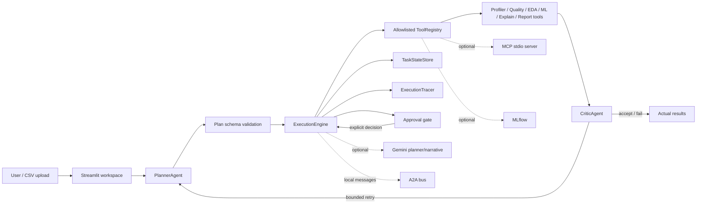

# Multi-Agent AutoML Data Analyst (MCP + A2A + Gemini Powered)

Automated Profiler → EDA → AutoML → Verifier → Notebook Synthesizer → Gemini Insights

🚀 Live Demo (Render Deployment):
https://multiagent-data-analyst.onrender.com/

Track: Enterprise Agents

Tech: Python, Streamlit, Gemini, MCP Tools, A2A Bus, Multi-Agent Architecture

# Overview

The Multi-Agent Data Analyst is a fully automated, end-to-end data analysis pipeline powered by multiple specialized agents working together.
It uploads a dataset, analyzes it, builds ML models, verifies the results, generates notebooks, and produces final insights — without any manual coding.

This project demonstrates:

✔ Multi-agent systems

✔ A2A (Agent-to-Agent) 

✔ Tool-based agent execution (MCP Tools)

✔ Sessions & memory

✔ Context-aware notebook synthesis

✔ Gemini-powered explanations

✔ Streamlit multi-page application

## Phase 1 agentic workflow

The application now includes a goal-driven local workflow alongside the existing analyst pages:

`User goal → PlannerAgent → allowlisted ToolRegistry → ExecutionEngine → CriticAgent → (bounded re-plan)`

The planner returns a validated JSON-compatible plan. With `GEMINI_API_KEY` configured it can use Gemini to select among the registered tools; without the key it uses a small goal-sensitive local planner. Tool execution is deterministic and never evaluates generated Python. `TaskStateStore` records each plan, step, output, critic decision, error, and retry count in `project_storage/tasks.json`. The critic applies basic checks only; richer model evaluation is deferred.

Open **Agentic Analysis** in the Streamlit multipage navigation after uploading a CSV. The equivalent CLI is:

```powershell
python src/orchestrator.py path\to\data.csv --goal "Analyze the data and identify important factors" --target target_column
```

The canonical A2A implementation is `src/core/a2a_bus.py`. `src/tools/a2a_tools.py` remains as a compatibility import for the existing dashboard and now exposes that same implementation.

## Phase 2 ML capabilities

The AutoML path uses stratified cross-validation for classification and shuffled K-fold validation for regression. It compares Logistic Regression, Random Forest, HistGradientBoosting, SVM, and KNN classifiers; regression candidates include Linear Regression, Ridge, Random Forest, GradientBoosting, HistGradientBoosting, and SVR. It reports fold mean/deviation, training and held-out metrics, detects severe class imbalance, and supports bounded randomized tuning of the leading candidate.

`DataQualityAgent` measures missingness, duplicates, constant and near-constant columns, cardinality, likely identifiers, non-finite values, IQR outliers, class balance, and possible target leakage. Its 0–100 score uses an explicit penalty per observed issue/warning. `ExplainabilityAgent` prefers SHAP for supported tree models when SHAP is installed, then falls back to model-native importance, coefficients, or permutation importance. Local explanations use SHAP or per-feature prediction perturbations. SHAP is optional; the core app does not require it.

Experiments save a versioned preprocessing/model pipeline and feature schema under `models/`; the artifact can be loaded with `ModelTools.load_artifact()` or used through `ModelTools.predict()`. Unit tests can be run with `python -m unittest discover -s tests -v` after installing `requirements.txt`.

## Phase 3 AI infrastructure

### MCP server

`src/mcp_server.py` implements an MCP server using the official Python SDK and stdio transport. It registers the existing `ToolRegistry` operations for profiling, quality, EDA, training/comparison, evaluation, explainability, and reports. Train a model before evaluation/explanation in the same server process; the in-process cache is intentionally not a cross-session model store.

```powershell
pip install -r requirements.txt
$env:AGENTIC_DATA_DIR = (Resolve-Path .\streamlit_app_storage\uploads).Path
python src/mcp_server.py
```

MCP clients should launch the command as an stdio server. Dataset arguments are CSV basenames resolved within `AGENTIC_DATA_DIR`; parent paths and non-CSV files are rejected. `AGENTIC_MCP_MAX_DATASET_BYTES` defaults to 50 MiB and `AGENTIC_MCP_MAX_DATASET_ROWS` defaults to 100,000. Model CV folds and randomized-search trials are bounded by tool input validation. MCP writes protocol messages to stdout, so application logging belongs on stderr.

### A2A lifecycle

`A2ABus.publish` validates JSON payloads and creates a message with message/task/correlation IDs, sender/recipient, type, status, timestamp, retry count, and error field. `fetch`/`peek` preserve the dashboard API. A consumer may pass a fetched message to `dispatch(handler, timeout_seconds=..., max_retries=...)`; success and failure are explicit and successful message IDs are deduplicated within the process. A Python thread cannot forcibly interrupt a timed-out handler, so timeout-sensitive handlers should be idempotent; the timeout bounds how long the caller waits, not the underlying worker's lifetime. This is a local in-process bus, not a distributed queue. Legacy `src/tools/a2a_tools.py` imports the canonical implementation.

### Workflow state, memory, and traces

`TaskStateStore` writes versioned JSON snapshots atomically to `project_storage/tasks.json`. It preserves status, plan, step results, evaluation summaries, artifact references, approvals, and execution history; raw sample rows/data are removed before persistence. Corrupt or missing JSON is treated as empty state, and `cleanup()` removes only old terminal tasks. `AnalyticalMemoryStore` writes separate compact findings to `project_storage/analytical_memory.json`, supports relevance-ranked retrieval, and rejects records containing secret-like values. The execution engine retrieves by dataset schema signature and stores only metric/quality summaries and artifact references.

`ExecutionTracer` appends correlated JSONL events at `project_storage/execution_traces.jsonl` (override with `AGENTIC_TRACE_PATH`). It records tool/workflow status, duration, agent, retries, replans, approvals, and errors; it excludes prompt/data fields and redacts common secret patterns. LLM token counts are not available from the current planner interface, so they are not reported. The JSONL file can be read by a future Streamlit trace view.

### Optional MLflow

Install the optional adapter with `pip install -r requirements-optional.txt` and set `MLFLOW_TRACKING_URI`, for example `file:./mlruns`. `MLFLOW_EXPERIMENT_NAME` defaults to `AgenticDataLab`. Training logs model parameters, CV and final metrics, a dataset shape/fingerprint, and the saved model artifact. With no URI, tracking is disabled; when configured but MLflow cannot be imported or contacted, model training still succeeds and the result contains `tracking.status = unavailable`.

### Approval foundation

Configure comma-separated tool names in `AGENTIC_APPROVAL_TOOLS`, or pass a set/callback to `ExecutionEngine(approval_required=...)`. A gated step is saved as `pending_approval` and does not execute. `resolve_approval(task_id, step_id, approved, actor=...)` persists an approved/rejected decision and trace. Approved tasks can be resumed by calling `run` with the same task ID and input dataset. Rejected tasks remain terminal. The approval UI is not part of this phase.

### Reproducible benchmark

The versioned fixture data and task manifest are in `benchmarks/`. Execute with:

```powershell
python benchmarks/run_benchmark.py
```

The runner saves each real success, validation rejection, or failure to a fresh timestamped file in `benchmark_results/` by default (or to `AGENTIC_BENCHMARK_OUTPUT`). It asks the local deterministic planner to produce a plan for each valid task, then runs the applicable tool path; no paid model service is called. Metrics are: task completion (successful valid tasks plus correctly rejected invalid/ambiguous tasks divided by all tasks); schema validity (accepted tool schemas or expected safe rejection divided by all tasks); plan validity (valid planner schemas divided by valid-plan tasks); tool-selection match (expected operation appears in the locally generated plan, divided by tasks with an expected tool); tool success (successful valid operations divided by valid tasks); evidence coverage (successful results with at least one non-status result field divided by successful valid operations); failure rate (unexpected failures divided by all tasks); retry rate (tasks with an actual timeout retry divided by all tasks); and mean wall duration. These are deterministic harness checks, not validated general-purpose agent accuracy scores.

### Configuration and validation

Runtime requirements are declared in `requirements.txt`; MLflow and SHAP remain optional. Existing `GEMINI_API_KEY` remains optional for planning, and `GOOGLE_API_KEY` optionally enables notebook report insights. Other settings: `AGENTIC_DATA_DIR`, `AGENTIC_MCP_MAX_DATASET_BYTES`, `AGENTIC_MCP_MAX_DATASET_ROWS`, `AGENTIC_TRACE_PATH`, `AGENTIC_APPROVAL_TOOLS`, `AGENTIC_BENCHMARK_OUTPUT`, `MLFLOW_TRACKING_URI`, and `MLFLOW_EXPERIMENT_NAME`. Never put credential values in workflow goals or benchmark fixtures. No arbitrary shell or generated Python execution is exposed.

Run targeted and full tests with:

```powershell
python -m unittest discover -s tests -p test_phase3_infrastructure.py -v
python -m unittest discover -s tests -v
```

In the available Python 3.12.14 runtime, `compileall` succeeded; the Phase 3 infrastructure suite ran 11 tests with 10 passing and the MCP protocol integration test skipped; all 6 existing agentic architecture tests passed. The full discovery run had one import error because `scikit-learn` was unavailable, and it skipped MCP protocol integration because the installed runtime did not include the SDK. The benchmark result records 9 task outcomes, including failures caused by the missing `scikit-learn` and `matplotlib` packages. Live MCP discovery/calls and the ML model tests need a project environment installed from `requirements.txt` before they can be verified.

## Phase 4: local app, deployment, and demo

### Install and start

Use Python 3.12 (the Docker image uses Python 3.12). In PowerShell:

```powershell
python -m venv .venv
.\.venv\Scripts\Activate.ps1
python -m pip install --upgrade pip
pip install -r requirements.txt
Copy-Item .env.example .env
streamlit run streamlit_app/app.py
```

The Home page accepts CSV uploads up to 50 MiB / 100,000 rows and keeps the frame in the current Streamlit session. The Agentic Analysis page invokes `ExecutionEngine` and its existing typed `ToolRegistry`; it shows data quality, selected plan, tool outputs, model comparison, recorded metrics, report references, trace events, approval actions, and persisted model-run summaries. LLM text is labeled separately from tool-computed results. No credential is required for heuristic planning or numerical tools. `GEMINI_API_KEY` enables optional Gemini planner/model narrative features; `GOOGLE_API_KEY` enables the optional report narrative. MLflow tracking is disabled unless `MLFLOW_TRACKING_URI` is configured. SHAP is optional and model-native/permutation fallbacks are used when possible.

### Docker

Copy `.env.example` to `.env`, optionally fill only the credentials/integrations you intend to use, then run:

```powershell
docker compose up --build
```

Open `http://localhost:8501`. `compose.yaml` persists task/traces, model artifacts, reports, and Streamlit storage in named volumes. The container runs as `appuser`; its health check calls Streamlit's `/_stcore/health` endpoint. No database service is needed for the file-backed stores. Docker configuration has been added, but image build and live health validation remain unverified when Docker is unavailable.

### Repeatable synthetic demo

Upload `benchmarks/synthetic_classification.csv` in the app. In Agentic Analysis, run quality analysis, then use a goal such as “Profile the dataset, run EDA, compare classification models for target, evaluate the best candidate, explain it if possible, and generate a report.” The page displays tool-returned outcomes and real traces. Model training and SHAP explanation require dependencies from `requirements.txt` and a generated model artifact; the report can still be generated from available outputs. The CSV is generated synthetic fixture data.

### Configuration and security boundaries

`.env.example` contains blank placeholders. Do not commit `.env`. The app currently accepts CSV only; malformed content, duplicate columns, empty files, oversized uploads, and over-limit row counts are rejected with user-facing messages. Tool schemas validate arguments, `FileTools` resolves paths under its storage root, and no unrestricted shell or generated Python is executed. Generated notebooks contain markdown and JSON outputs and are not executed. Data stays in local app storage unless an enabled external Gemini/MLflow integration receives relevant inputs. This is a single-process local deployment design, not a security-reviewed multi-user production service; authentication, tenant isolation, durable distributed storage, and sandboxing are not implemented.

The local A2A bus is process-local. Approval decisions are persisted and the UI resumes only after explicit approval; resumption is bound to the reviewed dataset digest. File-backed JSON stores are suitable for this demo but not concurrent multi-replica writes.

### Tests and benchmark

```powershell
python -m unittest discover -s tests -p test_phase4_integration.py -v
python -m unittest discover -s tests -p test_phase3_infrastructure.py -v
python -m unittest discover -s tests -v
python benchmarks/run_benchmark.py
```

The benchmark writes a fresh timestamped `benchmark_results/run_*.json` on each run, preserving prior results. Set `AGENTIC_BENCHMARK_OUTPUT` to choose a specific output path. The runner records dependency-related failures as outcomes and does not fabricate success. For interview discussion, see [INTERVIEW_GUIDE.md](INTERVIEW_GUIDE.md).

### Validation snapshot (2026-10-10)

In the available Python 3.12.14 runtime, `compileall` and `git diff --check` passed. Phase 4 integration tests: 5 passed, 1 skipped (model training skipped because scikit-learn is absent). Phase 3 infrastructure tests: 10 passed, 1 skipped (MCP SDK absent). Agentic architecture tests: 6 passed. Full unittest discovery is blocked by the existing Phase 2 test module failing to import `sklearn`. Streamlit startup and Docker build/health checks could not run because Streamlit and Docker are unavailable in this runtime. The executed benchmark is saved in `benchmark_results/run_20261010T100528_812535Z.json`: 9 tasks produced 2 successes, 2 expected rejections, and 5 dependency/feature failures (three missing scikit-learn model tasks, explainability without a trained artifact, and report generation without matplotlib). These counts describe this environment run only.

### Architecture



### Troubleshooting

- `ModuleNotFoundError: sklearn`, `matplotlib`, `streamlit`, or `mcp`: activate the project environment and install `requirements.txt`; MCP protocol mode additionally requires its SDK.
- Gemini planning is unavailable: remove/set no key to use deterministic local planning, or configure `GEMINI_API_KEY` and check provider/network access. Numerical tools do not require Gemini.
- Model tools fail: check the tool's displayed error and install the required ML dependencies; ensure the chosen target is present and has enough usable rows/classes.
- No experiment records: history is populated from persisted successful workflow training outputs. MLflow is optional and only logs when configured.
- Docker can't read `.env`: create it from `.env.example` in the repository root before `docker compose up --build`.


# Problem Statement

Performing data analysis typically requires switching between tools, writing repetitive code, running models manually, validating outputs, and documenting everything.

For beginners, this is overwhelming.

For analysts, it's time-consuming.

For teams, it’s inconsistent.

# Goal: Build an agentic system that automates the entire workflow — from raw data to verified insights and notebook generation.

# Why Agents?

Agents make the system:

 -> Modular — each agent does one job

 -> Autonomous — actions happen without the user triggering each step

 -> Traceable — every step is observable

 -> Composable — agents communicate using A2A bus

 -> Extensible — new agents (e.g., Gemini Reviewer) can be added anytime

Instead of one giant notebook, the intelligence is distributed:

# Agent Roles

 -> Profiler Agent – inspects dataset, finds issues

 -> EDA Agent – generates charts, summaries, anomalies

 -> Model Agent (AutoML) – builds ML pipelines automatically

 -> Verifier Agent – detects inconsistencies, bad models, missing columns

 -> Notebook Synthesizer Agent – creates a clean notebook combining all outputs

 -> Gemini Agent – explains the ML results in human-friendly language

# Each agent writes outputs to memory → A2A orchestrates → Next agent reacts.

# Architecture


1️⃣ ProfilerAgent

✔ Reads dataset

✔ Detects column types

✔ Finds missing values

✔ Sends message → EDAAgent

2️⃣ EDAAgent

✔ Creates correlations, histograms, outlier analysis

✔ Saves all plots via MCP FileTools

✔ Sends message → ModelAgent

3️⃣ ModelAgent

✔ Auto-detects task type (classification/regression)

✔ Builds full ML pipeline (imputation + scaling + encoding)

✔ Tunes models

✔ Saves best model

✔ Sends message → VerifierAgent

4️⃣ VerifierAgent

✔ Validates model quality

✔ Computes quality tag (“Good”, “Acceptable”, “Weak”)

✔ Sends message → NotebookAgent

5️⃣ NotebookSynthesizerAgent

✔ Builds a full auto-generated Jupyter Notebook

✔ Embeds all results and images

✔ Saves notebook through FileTools

6️⃣ Gemini Integration

✔ Gemini generates:

✔ Model explanations

✔ Recommendations

✔ Summaries

Plain-English explanations for beginners

7️⃣ Streamlit UI

✔ Beautiful dashboard with:

✔ Dataset Explorer

✔ EDA Dashboard

✔ AutoML Dashboard

✔ Verifier & Notebook Builder

✔ A2A Communications Console

# Setup Instructions

Clone Repo

 1. git clone https://github.com/yourusername/multiagent-data-analyst
 
 2. cd multiagent-data-analyst

 3. pip install -r requirements.txt

 4. Add Gemini API Key

 5. Create .env:

 6. Run Streamlit -> streamlit run streamlit_app/app.py

# Demo (Screenshots)

# Dataset Upload


# EDA Dashboard


# AutoML Results


# Gemini Explanation


# A2A Console


# Notebook generated


# Profiler Agent Output - 


# Verifier Agent - 


# Tools & Technologies Used

🚀Category	Tools

🚀Multi-Agent	Custom Agents, A2A Bus

🚀LLM	Gemini 1.5 Flash

🚀UI	Streamlit

🚀ML	Scikit-Learn

🚀Storage	Custom MemoryTools

🚀Notebook	nbformat

🚀Deployment	Render

🚀Visualization	Plotly, Matplotlib, Seaborn

🚀 LLM	Gemini 1.5 Flash


# 🗂 Project Structure

# multiagent-data-analyst/

│

├── src/

│   ├── agents/

│   ├── core/

│   ├── tools/

│   │   ├── file_tools.py

│   │   ├── dataset_tools.py

│   │   ├── memory_tools.py

│   │   ├── model_tools.py

│   │   └── notebook_tools.py

│

├── streamlit_app/

│   ├── app.py

│   └── pages/

│       ├── AutoML.py

│       ├── Profiler.py

│       ├── EDA_Dashboard.py

│       ├── Notebook_Report.py

│       ├── Verifier.py

│       └── A2A_Dashboard.py

│

├── streamlit_app_storage/

│   ├── memory/

│   ├── uploads/

│   └── reports/

│

└── README.md

 # Future Improvements

1. Add RAG-based “Data Question Answering Agent”

2. Add deployment on Google Cloud Run using Docker

3. Add Evaluation Agent for model fairness

4. Provide more AutoML models (XGBoost, LightGBM)

5. Add voice-based interaction mode

# Credits

Built by Vaishnavi Sharma as part of
Google x Kaggle – Agents Intensive 

# If you find this useful, ⭐ star the repo!
